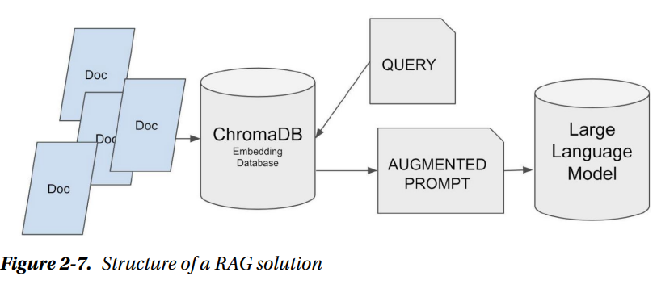

## Vector Databases
As their name suggests, these databases store information as numerical representations called vectors. So it is necessary to transform the text to store, into information that can be stored in these databases. In other words, you must convert the texts into vectors.To do that, the first step is to tokenize the text.
Tokens are the smallest units of text that are meaningful to the model. There are various types of tokens, including words, subwords, characters, and byte-pair encodings. The choice of token type depends on the specific use case and the language being modeled

Then, it is necessary to convert these tokens into vectors. A vector is simply a 
numerical representation of any data. In our specific case, it will be the numerical representation of the text to be stored. It represents a point in a multidimensional space. 
In other words, we don’t have to visualize the point on a two-dimensional or three dimensional plane, as we are used to. The vector can represent the point in any number 
of dimensions.

Once the text is converted, it is possible to calculate the difference between one vector and another or search for vectors that are closer to a specific one. That’s how it is possible to find similar texts to a reference one. For us, it may seem complicated or hard to imagine, but mathematically, there isn’t much difference between calculating the distance between two points whether they are in two, three, or any number of dimensions.
The trick lies in determining which vectors we assign to each word, as we want words with similar meanings to be closer in distance than those with more different meanings.
In a general:
* The text to store is tokenized and converted into embeddings, which 
are then stored in the vector database.
* The user’s question is also tokenized and converted into an 
embedding.
* The vector database is queried to find the embeddings that are 
closest to the user’s question embedding.
* These embeddings are then converted back into text and returned to 
the user as the answer.

Summary of the process a text undergoes before reaching a language model:
First, it’s tokenized, meaning it’s divided into small parts. Then, it’s converted into vectors, which in the world of large language models are known as embeddings. 
This vector, which contains numbers, is passed to the model, and it generates another vector as output. The vector that comes out of the model must undergo the reverse process and is converted into text.

The key is to utilize selected text related to the question and build a powered prompt with the information and the user request. In this way, the model has the necessary information to build a proper response.To select the text to use to enrich the prompt, a vectorized database is employed, enabling a search based on vector similarity. This ensures that the model has information relevant to what it needs to respond.

The figure below shows the structure of RAG:

