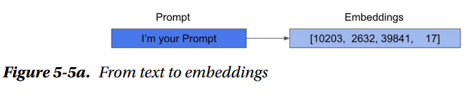
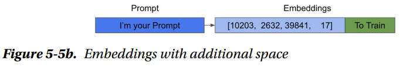
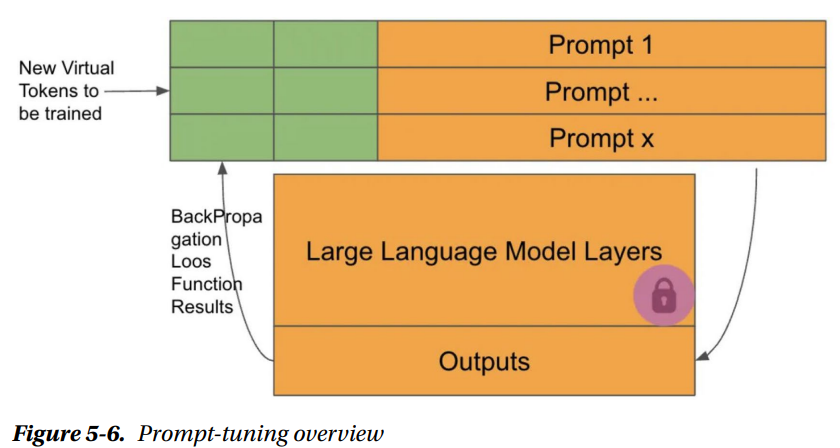

## Prompt Tuning
This is a technique that lies halfway between prompt engineering and fine-tuning. It involves letting the model itself modify the embeddings that form the prompt, making it more efficient.
It is an additive Fine-Tuning technique for models. This means that we will not modify any weights of the original model. You will train additional layers that are added to the model. Thats why its called an Additive technique.The layers youre going to add and train are releted to the prompt.
* Additive Fine-Tuning means you're adding new components (layers) to the model, but you're not altering the existing model weights. You only adjust the embeddings that represent the prompt.
A prompt is a series of instructions or inputs provided to a language model so that it generates a response or perfoms a specific task. Prompts are written in natural language, which can be any language the model is designed to handle. However, when the prompt is processed, the model doesnt receive the text itself, but a numerical representation of the words or tokens, known as embeddings.
 

To perfom the training,we introduce additional layers that modify the embeddings of the prompt. These layers are trainable, meaning they learn to adjust the embeddings to improve the model's performance on a specific task.the additional embeddings, are the ones that will have their weights modified through training. 
 

In simple words, When you use prompt tuning, you add some extra pieces of information (called extra space) to the embeddings, which are the numerical representations of the prompt. These extra pieces could be additional tokens or vectors.

You then train these new pieces of information to help the model better understand and respond to the prompt. This training adjusts only the extra space added to the embeddings, not the whole model.

In simple terms, the model is improving how it understands the prompt by learning how to adjust the extra information. But it doesn't change the core of the model, only the prompt's numerical representation.When you use prompt tuning, you add some extra pieces of information (called extra space) to the embeddings, which are the numerical representations of the prompt. These extra pieces could be additional tokens or vectors.

You then train these new pieces of information to help the model better understand and respond to the prompt. This training adjusts only the extra space added to the embeddings, not the whole model.

The model is improving how it understands the prompt by learning how to adjust the extra information. But it doesn't change the core of the model, only the prompt's numerical representation.

In other words, the model is creating a type of superprompt by enhancing a 
portion of the prompt with its acquired knowledge. However, that particular section 
of the prompt cannot be translated into natural language. It’s as if the model mastered 
expressing in embeddings and generating highly effective prompts.
All the weights of the pretrained model are locked, and cannot be modified during the training phase. 
