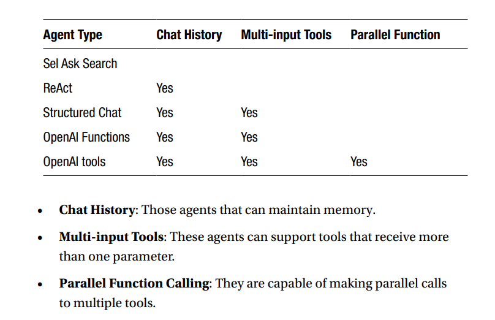

## Agents
An agent is an application that enables a large language model to use tools to achieve a goal.An agent is a more general term that refers to an AI system capable of performing tasks or making decisions based on its environment, user input, or specific goals. An agent can be seen as an intelligent system that doesn't just respond to queries but also takes actions or makes autonomous decisions based on a variety of factors.

The Agent receives a user request in natural language. It interprets and analyzes the intention and, with all its knowledge, generates what it needs to perform the first step.It could be an SQL query that is sent to the tool that the Agent knows will execute 
SQL queries. After a call to an API or tool, the agent analyzes if the received response is what the user wants. If it is, it returns the answer; if not, the Agent analyzes what the next step should be and iterates again.
In a brief, an Agent keeps generating commands using the tools it can control until it obtains the response the user is looking for. It is even capable of interpreting execution errors that occur and generates the corrected command. The Agent iterates until it satisfies the user’s question or reaches the limit we have set.

LangChain was the first library to implement agents and, today, is still the most advanced library for creating Agents, but two new actors have emerged: Hugging Face Transformers Agents and tools, and LlamaIndex.

Due to the nature of the agents, it is necessary to use models that are very powerful, capable of performing chained reasoning. In other words, the more powerful the model, the better.

a condensed version of the table available on the 
LangChain page

