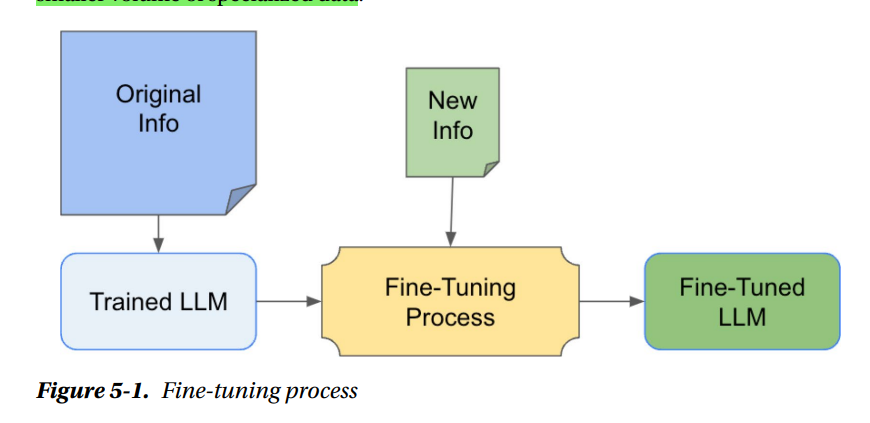

## Fine-Tuning Models
Fine-tuning is the process of adapting a previously trained model to specific tasks. This adaptation is achieved by conducting a second round of training with a smaller volume of specialized data. 

